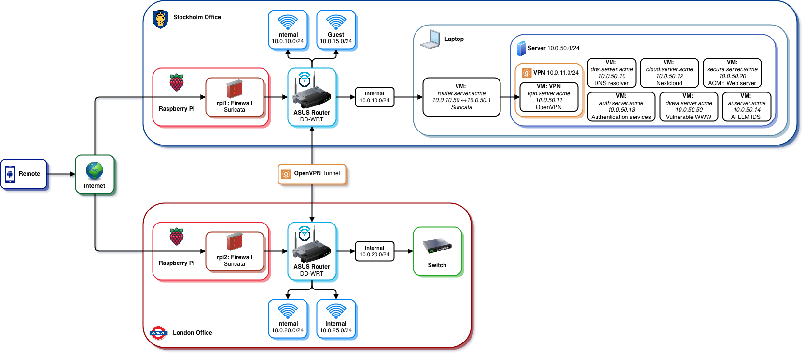

# acme-infrastructure

Infrastructure-as-code for an academic network security lab. Provisions a set of VMs and physical Raspberry Pi devices that together simulate a corporate network with PKI, identity management, VPN, DNS, cloud storage, and secure web services.

## Overview

This project is part of a course on network security and implements a full IAM and PKI stack using open-source tools: [Step CA](https://smallstep.com/docs/step-ca/) for certificate management, [Keycloak](https://www.keycloak.org/) for OIDC identity, [Suricata](https://suricata.io) for IDS and IPS, and [FreeRADIUS](https://freeradius.org/) for network authentication. Supporting services include OpenVPN, Nextcloud, an Apache HTTPS front-end, and an AI service — all running as VMs provisioned by Vagrant and configured by Ansible. Two Raspberry Pis provide physical WAN/LAN routing at each deployment site. Additionally, [DVWA](https://github.com/digininja/DVWA) is deployed as a vulnerable web application for comparing the performance between [ModSecurity](https://github.com/ModSecurity/ModSecurity) and with LLM-based log analysis.

## Architecture



### Network Layout

```
Internet / ISP
      |
  [eth0 DHCP]
  Raspberry Pi          ← physical device, one per site (Stockholm / London)
  [eth1 192.168.50.1]
      |   192.168.50.0/24
  Physical Router       ← gets address via RPi DHCP (192.168.50.x)
      |   10.0.10.0/24  (physical LAN)
  router.server.acme    ← VM bridged to physical LAN (10.0.10.50)
      |   10.0.50.0/24  (internal VM network)
  ┌───┴────────────────────────────────────┐
  dns  vpn  auth  cloud  ai  secure  dvwa
```

There are two sites, Stockholm and London. Each site has two subnets, internal and guest.

- Internal Stockholm `10.0.10.0/24`
- Internal London `10.0.20.0/24`
- Guest Stockholm `10.0.15.0/24`
- Guest London `10.0.25.0/24`

In Stockholm, the internal VM subnet is `10.0.50.0/24`. The Raspberry Pi at each site acts as a WAN/LAN pass-through router with NAT, placing the physical router (and in turn all VMs in Stockholm) behind it.

### Virtual Machines

| Service               | Host               | IP                     | Description                               |
| --------------------- | ------------------ | ---------------------- | ----------------------------------------- |
| Router                | router.server.acme | 10.0.10.50 / 10.0.50.1 | NAT gateway, bridges physical, IDS/IPS and VM LANs |
| DNS                   | dns.server.acme    | 10.0.50.10             | Unbound DNS resolver                      |
| VPN                   | vpn.server.acme    | 10.0.50.11             | OpenVPN server                            |
| Cloud Storage         | cloud.server.acme  | 10.0.50.12             | Nextcloud with OIDC integration           |
| Certificate Authority | auth.server.acme   | 10.0.50.13             | Step CA, Keycloak OIDC, FreeRADIUS        |
| AI                    | ai.server.acme     | 10.0.50.14             | AI service deployment                     |
| Secure Web            | secure.server.acme | 10.0.50.20             | Apache HTTPS with OIDC authentication     |
| DVWA                  | dvwa.server.acme   | 10.0.50.50             | Damn Vulnerable Web App (lab environment), ModSecurity |

### Physical Devices

| Device             | Host             | LAN IP       | Description                                              |
| ------------------ | ---------------- | ------------ | -------------------------------------------------------- |
| RPi 1              | rpi1.server.acme | 192.168.50.1 | WAN/LAN router in front of the Stockholm physical router IDS/IPS |
| RPi 2              | rpi2.server.acme | 192.168.50.1 | WAN/LAN router in front of the London physical router,  IDS/IPS   |
| ASUS AC1900 Router | acme-stockholm   | 10.0.10.1    | Router and AP for Stockholm site                         |
| ASUS AC1900 Router | acme-london      | 10.0.20.1    | Router and AP for London site                            |

The RPis are reachable for Ansible management via dynamic DNS (`rpi1-hacme.mooo.com`, `rpi2-hacme.mooo.com`). Each Pi bridges its WAN interface (`eth0`, DHCP from ISP) to a LAN interface (`eth1`, static `192.168.50.1/24`) and runs a DHCP server for the downstream physical router.

## Prerequisites

On macOS, use [Homebrew](https://brew.sh/).

**For VM provisioning:**

- [Vagrant](https://developer.hashicorp.com/vagrant/install)
- [VirtualBox](https://www.virtualbox.org/wiki/Downloads) — if you have an M-series MacBook, use `macOS / Apple Silicon hosts`
- [direnv](https://direnv.net/) (recommended) — also [hook it to your shell](https://direnv.net/docs/hook.html)

```bash
brew tap hashicorp/tap
brew install hashicorp/tap/hashicorp-vagrant
```

**For Ansible (VM and RPi configuration):**

- Python 3 with `pip`
- Ansible

We recommend installing direnv and hooking it to your shell.

```bash
brew install python direnv
```

When you `cd ansible`, you can run `direnv allow` which will load the default `.envrc`. This will set up a new Python virtualenv automatically. Once inside this virtualenv, you can do:

```
pip install -r requirements.txt
```

## Getting Started

### 1. Set up Virtual Machines (Vagrant)

Go to the `vagrant` directory and configure the bridge interface. You can copy the example env file:

```bash
cd vagrant
cp .envrc.example .envrc
# Modify .envrc with the correct bridge interface
# Run VBoxManage list bridgedifs | grep "^Name:"
direnv allow .
```

Run the setup script to start the VMS and generate the SSH config for Ansible:

```bash
./setup.sh
```

### 2. Configure Ansible

Make sure you have a virtual environment set up:

```bash
cd ../ansible
direnv allow . # This will create a new .venv
pip install -r requirements.txt
```

### 3. Run Playbooks

Run individual playbooks as needed:

```bash
ansible-playbook dns.yml
```

Or run the full stack with the master playbook:

```bash
ansible-playbook all.yml
```

### 4. Configure Raspberry Pis

To manage the Raspberry Pis, first decrypt the SSH key (from the `ansible` directory):

```bash
make
```

This decrypts the vault-encrypted SSH key to `/tmp/acme_rpi_id_ed25519`.

Now you can run the `raspberrypi.yml` playbook, which will configure the Raspberry Pi's.

```bash
ansible-playbook raspberrypi.yml
```

## Project Structure

```
acme-infrastructure/
├── ansible/      # Playbooks and roles for all services
├── vagrant/      # VM definitions and provisioning
```

## Configuration

The only configuration variable is `BRIDGE_ADAPTER` within `vagrant/.envrc`, which is the name of the network adapter you want to bridge the router VM to.

All other configuration is within variables inside the `ansible` directory. All variables have sane defaults.

## References

- [Unbound](https://nlnetlabs.nl/projects/unbound/) — DNS resolver
- [OpenVPN](https://openvpn.net/) — VPN server
- [Nextcloud](https://nextcloud.com/) — Cloud storage
- [Ollama](https://ollama.com/) — Local AI service
- [DVWA](https://github.com/digininja/DVWA) — Damn Vulnerable Web Application
- [Ansible](https://docs.ansible.com/) — Configuration management
- [Solitara](https://suricata.io) - Intrution Detection
- [ModSecurity](https://modsecurity.org) - ModSecurity

## License

The project is licensed under MIT, see [LICENSE](LICENSE).
